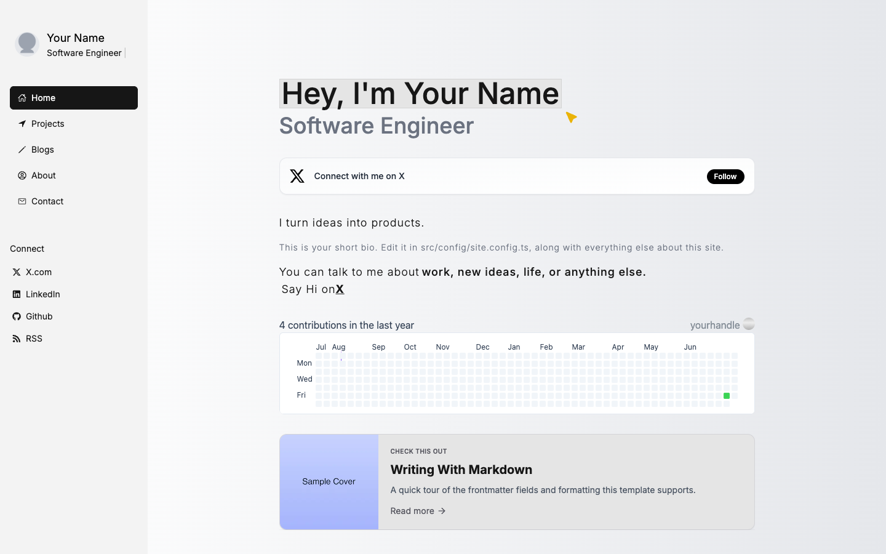

<div align="center">

# Next.js Portfolio Starter

**A clean, config-driven portfolio. Edit one file, drop in markdown, deploy.**

[](https://github.com/onlyoneaman/nextjs-portfolio-starter/stargazers)
[](https://x.com/onlyoneaman)
[](./LICENSE)

[**Use this template**](https://github.com/onlyoneaman/nextjs-portfolio-starter/generate) · [Live demo](https://amankumar.ai) · [Report a bug](https://github.com/onlyoneaman/nextjs-portfolio-starter/issues)



⭐ **Find this useful? Star the repo and [follow @onlyoneaman](https://x.com/onlyoneaman) — it genuinely helps.**

</div>

Built with Next.js 14, Tailwind CSS, and shadcn/ui. Blog and projects are plain
markdown files; your identity, links, SEO, and navigation all live in a single
`site.config.ts`. Adapted from [amankumar.ai](https://amankumar.ai).

## Features

- Config-driven — all personal data in `src/config/site.config.ts`
- Markdown blog and projects (frontmatter via gray-matter)
- SEO defaults, JSON-LD, sitemap, and RSS generated for you
- Dark mode, responsive layout, shadcn/ui components
- Optional Google Analytics + PostHog, Cal.com contact booking
- Agent-friendly: an `AGENTS.md` lets an AI assistant personalize it for you

## Quick start

The fastest way is the green **“Use this template”** button at the top of the GitHub
repo — it creates your own fresh repo with no history. Then:

```bash
git clone https://github.com/<you>/<your-repo>.git
cd <your-repo>
npm install
npm run dev
```

Open http://localhost:3000.

## Customize

1. **Identity** — edit every field in `src/config/site.config.ts` (name, role, bio,
   email, socials, SEO, nav, `calLink`, `githubUsername`). Leave a field blank (`""`)
   to hide the UI it controls.
2. **Assets** — replace `public/images/avatar.png` and `public/resume.pdf`; update
   `public/site.webmanifest` and the favicons in `public/`.
3. **Experience** — edit `src/data/experiencesData.ts` (shown on the About page) and
   the logos in `public/images/companies/`.
4. **Content** — delete the samples in `content/blogs/` and `content/projects/` and
   add your own `.md` files. The filename becomes the URL slug; put images under
   `public/content/...`.
5. **llms.txt** — update `public/llms.txt` with your name and pages.

Prefer to let an AI do it? Open this repo in any agent that reads `AGENTS.md`
(Claude Code, Codex, Cursor, Copilot, Gemini CLI…) and ask it to "personalize this
portfolio template for me" — the playbook in `AGENTS.md` walks it through every step.

## Environment variables

All optional — see `.env.example`. Copy it to `.env.local`:

| Variable | Purpose |
| --- | --- |
| `SITE_URL` | Base URL for sitemap + RSS |
| `NEXT_PUBLIC_MEASUREMENT_ID` | Google Analytics (blank = off) |
| `NEXT_PUBLIC_POSTHOG_KEY` / `NEXT_PUBLIC_POSTHOG_HOST` | PostHog (blank = off) |

## Deploy

`npm run build` also generates the sitemap and RSS feed (via the `postbuild` step).

### Cloudflare Pages (Git integration)

This template deploys as-is on Cloudflare Pages — the site is fully static (SSG).

1. Push your repo to GitHub (the **Use this template** button does this).
2. Cloudflare dashboard → **Workers & Pages** → **Create** → **Pages** → **Connect to Git**,
   and pick your repo.
3. Build settings:
   - **Framework preset:** `Next.js` (fills in the build command and output directory)
   - **Build command:** `npm run build`
4. **Settings → Functions → Compatibility flags:** add `nodejs_compat` (required for the
   Next.js build on Cloudflare).
5. **Settings → Environment variables:** add `SITE_URL` (your deployed URL), plus the
   optional analytics keys from the table above.
6. **Save and Deploy.** Pushes to your default branch redeploy automatically.

> The included `.npmrc` (`legacy-peer-deps=true`) is what lets the install succeed on
> Cloudflare's build image — keep it. Node version is read from `.nvmrc`; if the build
> picks the wrong one, set a `NODE_VERSION` environment variable to match.

### Vercel (alternative)

Import the repo at [vercel.com/new](https://vercel.com/new), set `SITE_URL` in the
project's environment variables, and deploy.

## Feedback

Got ideas or improvements? [Open an issue or a PR](https://github.com/onlyoneaman/nextjs-portfolio-starter/issues) — happy to hear them.

## License

MIT — see [LICENSE](./LICENSE). The **code** is free to use. Please replace all
personal content and branding with your own; don't ship it with the sample identity,
and don't present someone else's writing as yours.

Built by [Aman](https://amankumar.ai) · [@onlyoneaman](https://x.com/onlyoneaman)
